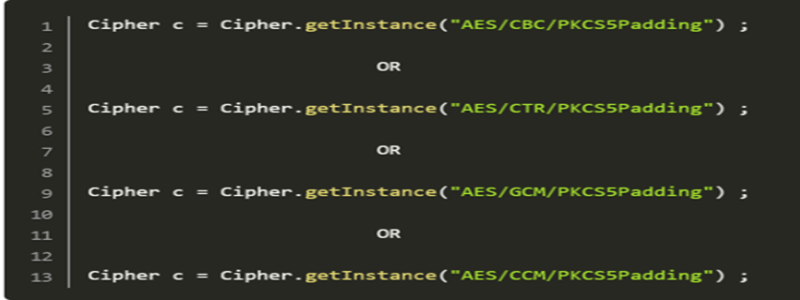

# Cipher algorithms
**Cipher Algorithms** อัลกอริทึมการเข้ารหัสที่มีประสิทธิภาพทนทานต่อการโจมตีในรูปแบบของการสุ่มรหัสผ่าน (brute force attacks)

**ซึ่งแน่นอนว่า** การเข้ารหัสลับจำเป็นมากเพราะการสื่อสารผ่านระบบถ้าไม่มีการเข้ารหัสลับ การส่งผ่านข้อมูลต่างๆ อาจถูกผู้ไม่หวังดีตรวจจับข้อมูลซึ่งเป็นข้อมูลสำคัญของเราได้

**คำแนะนำ** การใช้ทั่วไปในการเข้ารหัสลับ อัลกอริทึมที่แนะนำควรมีขนาดไม่ต่ำกว่า 128bits


### ตัวอย่างการใช้งานฟังก์ชันที่อาจไม่ปลอดภัย
```
import javax.crypto.Cipher;
import java.security.NoSuchAlgorithmException;
import javax.crypto.NoSuchPaddingException;

public class test {

    public static void main(String[] args) {
      try
      {
        Cipher c1 = Cipher.getInstance("DES"); // Noncompliant: DES works with 56-bit keys allow attacks via exhaustive search
        Cipher c7 = Cipher.getInstance("DESede"); // Noncompliant: Triple DES is vulnerable to meet-in-the-middle attack
        Cipher c13 = Cipher.getInstance("RC2"); // Noncompliant: RC2 is vulnerable to a related-key attack
        Cipher c19 = Cipher.getInstance("RC4"); // Noncompliant: vulnerable to several attacks (see https://en.wikipedia.org/wiki/RC4#Security)
        Cipher c25 = Cipher.getInstance("Blowfish"); // Noncompliant: Blowfish use a 64-bit block size makes it vulnerable to birthday attacks

        NullCipher nc = new NullCipher(); // Noncompliant: the NullCipher class provides an "identity cipher" one that does not transform or encrypt the plaintext in any way.
      }
      catch(NoSuchAlgorithmException|NoSuchPaddingException e)
      {
      }
    }
}
```

### ตัวอย่างการใช้งานฟังก์ชันที่แนะนำ
```
import javax.crypto.Cipher;
import java.security.NoSuchAlgorithmException;
import javax.crypto.NoSuchPaddingException;

public class test {

    public static void main(String[] args) {
      try
      {
        Cipher c31 = Cipher.getInstance("AES/GCM/NoPadding"); // Compliant
      }
      catch(NoSuchAlgorithmException|NoSuchPaddingException e)
      {
      }
    }
}
```

### Reference
* [OWASP Top 10 2017 Category A3](https://www.owasp.org/index.php/Top_10-2017_A3-Sensitive_Data_Exposure) - Sensitive Data Exposure<br>
* [MITRE, CWE-327](https://cwe.mitre.org/data/definitions/327.html) - Use of a Broken or Risky Cryptographic Algorithm<br>
* [CERT, MSC61-J.](https://wiki.sei.cmu.edu/confluence/x/hDdGBQ) - Do not use insecure or weak cryptographic algorithms<br>
* [SANS Top 25](https://www.sans.org/top25-software-errors/#cat3) - Porous Defenses
