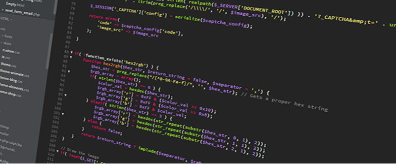

# exec
(PHP 4, PHP 5, PHP 7)

exec — เป็นฟังก์ชันที่ให้ PHP ไปเรียกใช้คำสั่ง Command line และจะคืนค่ากลับ (return)มาเป็น string บรรทัดสุดท้ายที่ได้จากการรันคำสั่ง $command

### รูปแบบการใช้งาน
```
exec ( string $command , array &$output = null , int &$result_code = null ) : string|false
```

**$command** คือ คำสั่งที่เราต้องการจะรัน

**$output** คือ ตัวแปรที่ใช้เก็บผลรับของการรันคำสั่ง $command ที่แสดงออกมา

**$result_code** คือ ค่าที่คำสั่ง $command ให้คืนกลับมา (return)


### ตัวอย่างการใช้งานฟังก์ชัน exec()
```
<?php
// outputs the username that owns the running php/httpd process
// (on a system with the "whoami" executable in the path)
$output=null;
$retval=null;
exec('whoami', $output, $retval);
echo "Returned with status $retval and output:\n";
print_r($output);
?>
```

### การแสดงผล
```
Returned with status 0 and output:
Array
(
    [0] => cmb
)
```

### Notes
***Warning*** When allowing user-supplied data to be passed to this function, use [escapeshellarg()](https://www.php.net/manual/en/function.escapeshellarg.php) or [escapeshellcmd()](https://www.php.net/manual/en/function.escapeshellcmd.php) to ensure that users cannot trick the system into executing arbitrary commands.

## เพิ่มเติม
https://www.php.net/manual/en/function.exec.php
