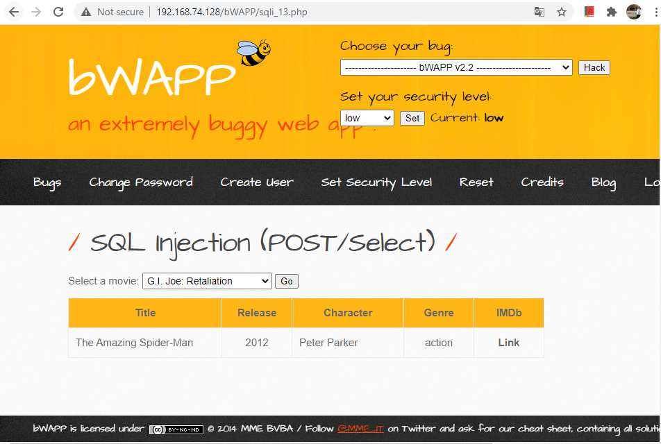
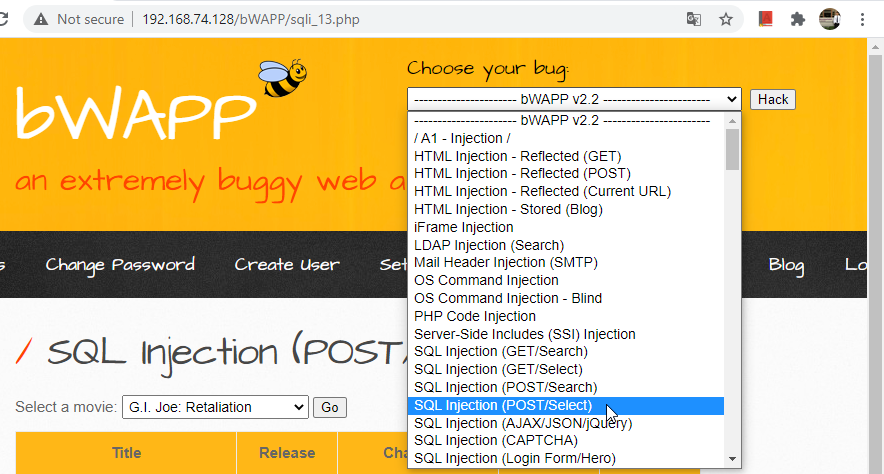
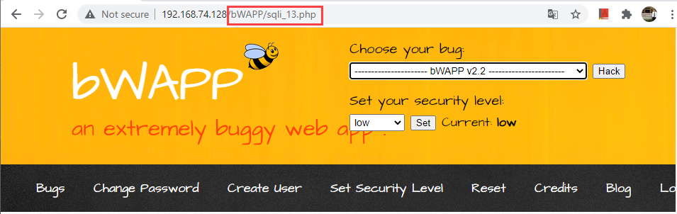
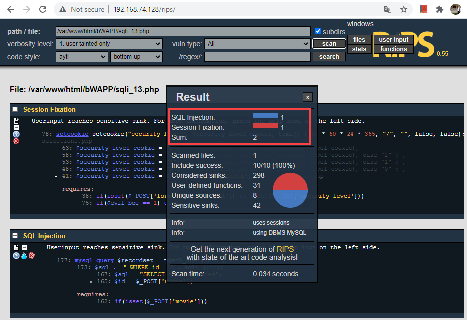
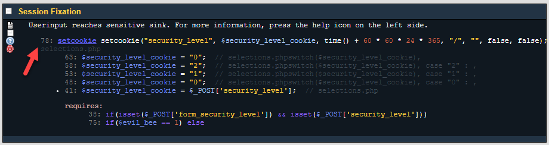
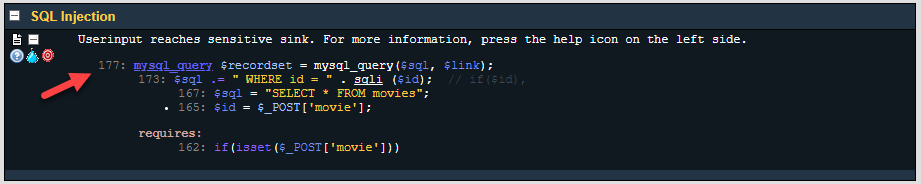
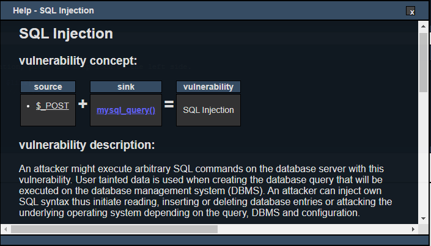
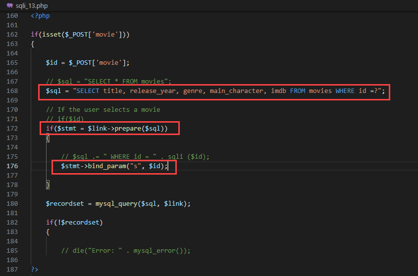
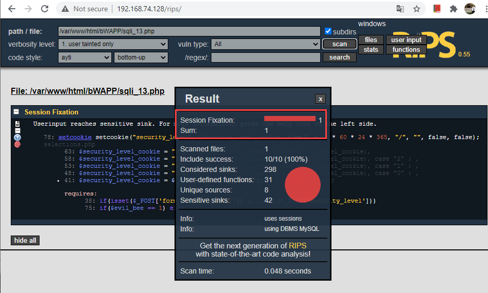

## SQL Injection (POST/Select)

### bWAPP Tutorials - SQL Injection (POST/Select)

### วิธีการทดสอบช่องโหว่ SQL Injection (POST/Select) 
1. เข้าไปที่ url http://192.168.74.128/login.php

2. เลือกตรวจสอบช่องโหว่ SQL Injection (POST/Select)

3. เมื่อเราได้ url หรือ location ที่ใช้ในการเรียกไฟล์มาเรียบร้อยแล้ว ให้เรานำ link ไปตรวจสอบช่องโหว่ที่ เครื่องมือ RIPS

### RIPS Scan
ตรวจสอบช่องโดยการนำไฟล์ sqli_13.php มา Scan หาช่องโหว่โดยใช้เครื่องมือ RIPS ผลลัพธ์จากการ Scan พบว่ามีช่องโหว่ในเรื่องของ SQL Injection ในบรรทัดที่ 177 และพบช่องโหว่ในเรื่องของ Session Fixation ในบรรทัดที่ 78 ของไฟล์

ซึ่งผลลัพธ์จากการ Scan เครื่องมือ RIPS จะมีคำแนะนำในการแก้เบื้อต้นด้วย

วิธีการแก้ไขให้เราตรวจสอบและแก้ไข ช่องโหว่ที่เกี่ยวข้องกับ sql injection จากตัวอย่างใช้การแกไขโดย Visual Studio Code
 

จากนั้น Save และใช้เครื่องมือ RIPS ตรวจสอบอีกครั้ง

### Members
- Nattapong Ketkaew
